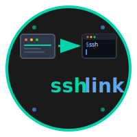

# sshlink

<div align="center">
  
  
  **🚀 One-click SSH connections from your browser to any terminal**
  
  [](https://golang.org/)
  [](https://github.com/icanhazstring/sshlink)
  [](https://opensource.org/licenses/MIT)
  
  [Installation](#-installation) • [Usage](#-usage) • [Configuration](#-configuration) • [Contributing](#-contributing)
</div>

---

## 🤔 The Problem

As developers, we constantly switch between web dashboards, monitoring tools, and documentation that display server IPs. Every time we need to SSH into a server, we have to:

- 🔄 **Copy the IP address**
- 🖥️ **Open a terminal manually**  
- ⌨️ **Type `ssh user@copied-ip`**
- 🔁 **Repeat this hundreds of times per day**

**What if you could just *click* an IP and instantly be connected via SSH?**

## ✨ The Solution

**sshlink** creates a seamless bridge between your browser and terminal. Turn any IP address on your web dashboards into a one-click SSH connection.

```html
<!-- Before: Copy-paste workflow -->
IP: 192.168.1.100

<!-- After: One-click magic -->
<a href="sshlink://192.168.1.100">192.168.1.100</a>
```

**Click the link → SSH session opens instantly!**

## 🚀 Features

- **🌍 Cross-Platform** - Works on macOS, (Linux, and Windows - coming soon)
- **🔧 Multiple Terminals** - Supports Terminal, iTerm, Kitty, Alacritty, WezTerm
- **⚡ Zero Configuration** - Works out of the box
- **🎨 Customizable** - JSON config for advanced setups
- **📦 Single Binary** - No dependencies, just download and run
- **🔗 Standard Protocol** - Uses `sshlink://` URL scheme

## 📦 Installation

### Quick Install (Recommended)

Download the latest binary for your platform from [Releases](https://github.com/icanhazstring/sshlink/releases):

```bash
# macOS (Intel)
curl -L https://github.com/icanhazstring/sshlink/releases/latest/download/sshlink-darwin-amd64 -o sshlink
chmod +x sshlink

# macOS (Apple Silicon)
curl -L https://github.com/icanhazstring/sshlink/releases/latest/download/sshlink-darwin-arm64 -o sshlink
chmod +x sshlink

# Linux (coming soon)
curl -L https://github.com/icanhazstring/sshlink/releases/latest/download/sshlink-linux-amd64 -o sshlink
chmod +x sshlink

# Windows (coming soon)
# Download sshlink-windows-amd64.exe from releases
```

### Install the Protocol Handler

```bash
# Default terminal
./sshlink -install

# Specific terminal (iTerm, Kitty, Alacritty, etc.)
./sshlink -install -terminal=iterm

# List supported terminals
./sshlink -list
```

### Package Managers (coming soon)

```bash
# Homebrew (macOS/Linux)
brew install icanhazstring/tap/sshlink
```

## 🎯 Usage

### Basic Usage

Once installed, use `sshlink://` links in any web page:

```html
<a href="sshlink://127.0.0.1">Connect to localhost</a>
<a href="sshlink://user@example.com">Connect with username</a>
<a href="sshlink://user@example.com:2222">Custom port</a>
```

### For Web Developers

Add sshlink support to your dashboards, monitoring tools, or documentation:

```javascript
// Transform IPs into clickable SSH links
function makeSSHLink(ip, user = '') {
  const target = user ? `${user}@${ip}` : ip;
  return `<a href="sshlink://${target}">${ip}</a>`;
}

// Example: Server monitoring dashboard
servers.forEach(server => {
  document.getElementById('server-list').innerHTML += 
    `<tr>
      <td>${server.name}</td>
      <td>${makeSSHLink(server.ip, 'admin')}</td>
      <td>${server.status}</td>
    </tr>`;
});
```

### Advanced Configuration

Create a custom `config.json` for specialized setups:

```json
{
  "terminal": "wezterm",
  "args": ["start", "--always-new-process"]
}
```

```bash
./sshlink -install -config=./config.json
```

## 🔧 Configuration

### Supported Terminals

| Terminal | macOS | Linux | Windows | Notes |
|----------|-------|-------|---------|-------|
| Terminal | ✅ | ❌ | ❌ | macOS default |
| iTerm | ✅ | ❌ | ❌ | AppleScript integration |
| Kitty | ✅ | ✅ | ✅ | Cross-platform |
| Alacritty | ✅ | ✅ | ✅ | Rust-based |
| WezTerm | ✅ | ✅ | ✅ | GPU-accelerated |
| Windows Terminal | ❌ | ❌ | ✅ | Windows 10+ |

### Custom Terminal Configuration

```json
{
  "terminal": "your-terminal",
  "args": ["-e", "zsh", "-c"]
}
```

## 🎨 Examples

### Kubernetes Dashboard
```html
<a href="sshlink://kubectl-node-1">kubectl-node-1</a>
<a href="sshlink://root@kubectl-node-2">kubectl-node-2</a>
```

### Docker Swarm Manager
```html
<a href="sshlink://swarm-manager">Connect to Swarm Manager</a>
```

### Development Servers
```html
<a href="sshlink://dev@staging.company.com">Staging Server</a>
<a href="sshlink://deploy@prod.company.com:2222">Production</a>
```

## 🗑️ Uninstall

```bash
./sshlink -uninstall
```

## 🤝 Contributing

We welcome contributions! Here's how to get started:

1. **Fork the repository**
2. **Create a feature branch**: `git checkout -b feature/amazing-feature`
3. **Commit your changes**: `git commit -m 'Add amazing feature'`
4. **Push to the branch**: `git push origin feature/amazing-feature`
5. **Open a Pull Request**

### Development Setup

```bash
# Clone the repository
git clone https://github.com/icanhazstring/sshlink.git
cd sshlink

# Build for your platform
go build -o sshlink .

# Test installation
./sshlink -install

# Run tests
go test ./...
```

## 📄 License

This project is licensed under the MIT License - see the [LICENSE](LICENSE) file for details.

## 🙏 Acknowledgments

- Inspired by the daily workflow pain of developers everywhere
- Built with ❤️ using [Go](https://golang.org/)
- Logo created with love for the developer community

---

<div align="center">
  <strong>Made with ❤️ for developers who value efficiency</strong>
  
  ⭐ **Star this repo if sshlink saves you time!** ⭐
</div>
